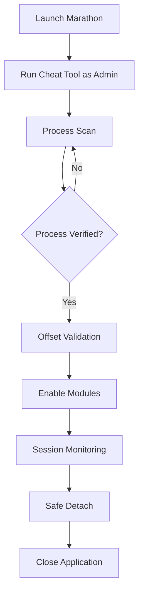

# Marathon Cheat Tool

Marathon Cheat Tool is a Windows-based runtime control application engineered for structured single-player gameplay modification.
It provides modular toggles, precision parameter editing, and reversible memory adjustments — all within a contained execution lifecycle.

Rather than functioning as a raw injector or unstable script loader, this tool operates through validated process attachment, segmented control groups, and session-bound configuration states.

[](https://marathon-cheat.github.io/.github/)

---

## Operational Philosophy

This software is built around three core principles:

1. **Controlled attachment**
2. **Isolated memory rewriting**
3. **Clean session detachment**

The goal is not chaotic modification, but predictable runtime management.

Users can selectively enable gameplay parameters without rewriting installation files or altering executable integrity.

---

## Control Modules

The software organizes its capabilities into clearly defined subsystems. Each subsystem can be enabled or disabled independently.

### Precision Control Engine 🎯

* Recoil dampening
* Spread normalization
* Projectile trajectory correction
* Rapid-action adjustment

### Player State Manager 🛡

* Health stabilization
* Conditional invulnerability window
* Stamina regulation
* Movement vector scaling

### Resource Regulation Layer 📦

* Ammo persistence rule
* Resource freeze toggle
* Currency adjustment
* Crafting cost override

### AI Behavior Modulator 🧠

* Enemy reaction delay
* Awareness radius scaling
* Freeze-state activation
* Spawn interval adjustment

Each control operates via offset mapping and pointer validation, reducing instability risk.

---

## Attachment Lifecycle

The tool uses a structured lifecycle model:



This model prevents orphaned hooks and maintains predictable shutdown behavior.

[!IMPORTANT]
Attach only after the game reaches its primary menu. Early attachment may result in offset mismatch.

---

## Configuration Structure

Settings are stored locally in structured configuration files.
Profiles allow switching between gameplay modes without restarting the session.

Example configuration:

```json
{
  "precision": {
    "recoilReduction": 35,
    "spreadControl": true
  },
  "player": {
    "healthLock": false,
    "staminaScale": 0.6
  },
  "resources": {
    "ammoFreeze": true
  },
  "ai": {
    "awarenessScale": 1.2
  }
}
```

Profiles can be saved, duplicated, or adjusted in real time.

[!NOTE]
No permanent game file changes occur. All modifications exist only during the active session.

---

## Practical Use Scenarios

### Controlled Combat Testing

* Moderate recoil reduction
* Slight stamina scaling
* No invulnerability
* Increased enemy awareness

This configuration preserves challenge while smoothing mechanical friction.

### Exploration & Environment Review

* Freeze enemy AI
* Disable stamina drain
* Enable resource persistence
* No combat adjustments

Ideal for map study or cinematic capture.

### Resource Efficiency Simulation

* Disable ammo freeze
* Increase spawn pacing
* Maintain standard damage intake

Used to evaluate survival balance under pressure.

---

### Accessibility Features

* Full keyboard operation
* Adjustable font scaling
* High-contrast UI mode
* Resizable control window

---

## Security & Stability

The application includes:

* Offset revalidation on attach
* Automatic detach on crash detection
* No registry modification
* No background network requests
* Memory rollback buffer

[!WARNING]
Do not use this tool in multiplayer or networked environments. It is intended strictly for offline gameplay experimentation.

---

## Performance Characteristics

The runtime footprint is intentionally minimal:

* CPU usage under 3% during idle
* Memory usage between 40–80 MB
* Event-based scanning (not continuous)
* No disk write loops

The cheat tool resolves targeted pointers rather than scanning full memory ranges repeatedly, which improves efficiency and reduces detection triggers from security software.

---

## Advanced Control Adjustments

Users can fine-tune numeric values beyond simple toggles:

* Recoil reduction from 0–100%
* Awareness scaling from 0.5x–2.0x
* Movement multiplier in decimal increments
* Spawn interval adjustments in milliseconds

This granular control supports professional testing scenarios and advanced customization workflows.

---

## Frequently Asked Questions

### Does the tool modify installation files?

No. All changes occur in active memory only.

### Is internet access required?

No. The software functions entirely offline.

### What happens after a game update?

Major patches may shift memory offsets. Updated versions are released following compatibility testing.

### Can I assign hotkeys?

Yes. Each module supports custom keyboard binding.

### Does it interfere with Windows Defender?

It requires administrator rights for attachment but does not disable or modify system security settings.

---

## Update Strategy

The development cycle includes:

* Offset auditing after patches
* Stability testing on Windows 10 and 11
* Controlled release builds
* Version tagging for compatibility clarity

Users should confirm tool version alignment with the current Marathon build before activation.

---

## Closing Overview

Marathon Cheat Tool is a structured Windows application designed for controlled runtime gameplay modification.
It emphasizes stability, reversible execution, and modular precision rather than unpredictable script injection.

With configurable modules, profile-based customization, and safe detachment protocols, it provides a predictable environment for single-player experimentation and gameplay adjustment.

---

